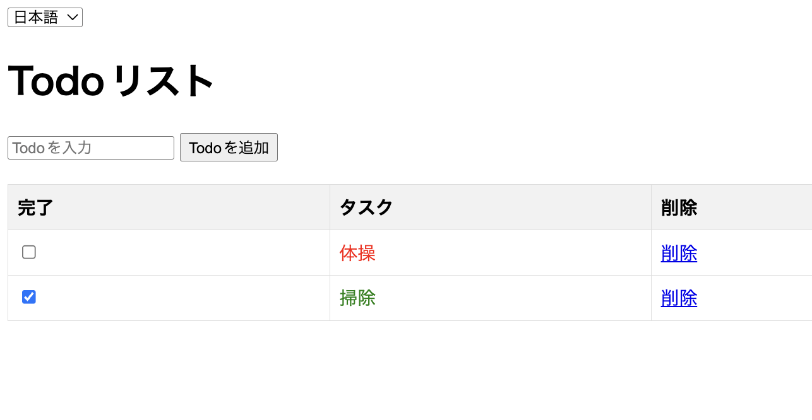

# Todoアプリ

## 概要

このアプリは、シンプルなTodoリストです。

## 使い方

1. アプリを起動します。
2. Todoを追加します。
3. Todoを完了します。
4. Todoを削除します。

## スクリーンショット



## ライセンス

このアプリは、MITライセンスで公開されています。

## 起動方法

```bash
python app.py
```

## テストの実行とカバレッジ計測方法

```bash
coverage run -m pytest
coverage report -m
```

## ファイル構成

```
.
├── .gitignore
├── LICENSE
├── README.md
├── app.py
├── static
│   ├── script.js
│   └── style.css
├── templates
│   └── index.html
├── tests
│   └── test_app.py
└── translations
    ├── en.json
    ├── ja.json
    └── zh.json
```

## その他

アプリケーション、テストコード、README、LICENSEファイルなどは、clineを利用して作成されました。
スクリーンショットは手動で作成しました。
